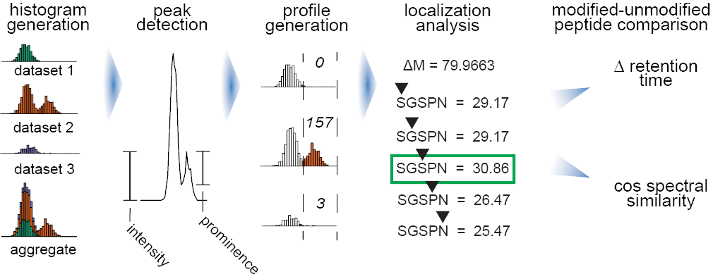

**Overview**

Open searching has proven to be an effective strategy for identifying both known and unknown modifications in shotgun proteomics experiments. Rather than being limited to a small set of user-specified modifications, open searches identify peptides with any mass shift that may correspond to a single modification or a combination of several modifications. Here we present PTM-Shepherd, a bioinformatics tool that automates characterization of PTM profiles detected in open searches based on attributes such as amino acid localization, fragmentation spectra similarity, retention time shifts, and relative modification rates. PTM-Shepherd can also perform multi-experiment comparisons for studying changes in modification profiles, e.g. in data generated in different laboratories or under different conditions.

It can be run either as a standalone JAR or as part of the FragPipe suite of tools.

**Workflow**

Data processing begins by aggregating the mass shifts across all datasets into a common histogram. Peaks are determined based on their prominence. The 500 most intense peaks in aggregate are then quantified for each dataset and normalized to size. Peptides with each mass shift are iteratively rescored with the peptide at each position, producing localization scores for each peptide and an aggregate localization enrichment for each mass shift. Finally, modified peptides and their unmodified counterparts are analyzed to have their pairwise cosine spectral similarity and change in retention time calculated.

**Running PTM-Shepherd**

java -jar ptm-shepherd.jar path/to/config.txt

**Required parameters**

Datasets are passed to PTM-Shepherd in the form of Philosopher psm.tsv files. If experiments (parameter: dataset) are given different names, they will be analyzed as separate experiments. If experiments share the same name, they will be pooled together during analysis. To pass datasets to PTM-Shepherd, format lines like this (one per psm.tsv file):

dataset = $DATASETNAME01[space]path/to/psm01.tsv[space]path/to/mzML/directory

dataset = $DATASETNAME02[space]path/to/psm02.tsv[space]path/to/mzML/directory

This is the only required parameter. 

**Optional parameters**

* threads → number of threads used for processing. Default is either 8 or the number of available threads, whichever is lower.
* histo_bindivs → takes integer values > 0. Number of bins per dalton to be used for mass shift binning. The default is 5000 bins, or 0.0002 Da bins.
* histo_smoothbins → takes integer values >= 0. Number of bins on each side of a bin that the weight of the bin is smoothed across. This smoothing traces a normal distribution. A value of 1, e.g., will smooth the weight of the bin across 1 bin to either side (3 bins total) using the weights 0.23 (bin to left), 0.49 (same bin), 0.23 (bin to right). Changing this parameter is not recommended for non-advanced users.
* peakpicking_promRatio → takes values between 0 and 1. Ratio of peak apex to peak height used to call peaks. Peak height is determined by checking the shorter of the two peak shoulders. Changing this parameter is not recommended for non-advanced users.
* peakpicking_mass_units → units in which peakpicking is done, 0  = Da and 1 = ppm. PPM peakpicking widths are calculated based on an average peptide mass plus the mass shift. Default is 0. Changing this parameter is not recommended for non-advanced users.
* peakpicking_width → takes values > 0. Width of signal used in signal-to-noise calculation for peakpicking. This parameter is applied symmetrically, so the true width is 2\*peakpicking_width. Changing this parameter is not recommended for non-advanced users.
* peakpicking_topN → takes values > 0. Number of peaks reported in output. Larger numbers have very small effects on processing time, so it is rarely beneficial to reduce the number of peaks reported.
* precursor_mass_units → units in which peak widths are selected, 0  = Da and 1 = ppm. PPM peak widths are calculated based on an average peptide mass plus the mass shift. Default is 0. Changing this parameter is not recommended for non-advanced users.
* precursor_tol → takes values > 0. Width of annotated peaks. Will assign final peak widths to either precursor_tol or detected width, whichever is more precise. Default is 0.01. Also determines which spectra are “zero bin” when doing modified to unmodified comparisons.
* spectra_ppmtol → takes number > 0. This is the tolerance applied when matching peaks for localization and similarity scoring
* spectra_condPeaks → takes integer > 0. This is the number of peaks that will be used when performing localization and similarity scoring.
* spectra_condRatio → takes number between 0 and 1. Minimum intensity used for peaks in localization and similarity scoring, expressed as a ratio of a peak’s intensity to the most intense peak.
* varmod_masses → takes a series of mass shifts and names expressed like Oxidation:15.9949,Acetylation:42.0106. These mass shifts are used and prioritized during peak annotation. The default is a failed carbamidomethylation event, so that modifications occurring on cysteine can be expressed as a combination of those two modifications. This is useful when working with enriched datasets or datasets with PTMs not enumerated in Unimod.
* localization_background → takes integer values 1-4. Background of peptides against which localization enrichment scores are calculated.
* * 1 = unique peptides with localizable mass shifts within the same bin are used as background
* * 2 = PSMs with localizable mass shifts within the same bin are used as background
* * 3 = unique peptides with localizable mass shifts within the entire dataset are used as background
* * 4 = PSMs with localizable mass shifts within the entire dataset are used as background
* mass_offsets → takes a / separated list of values, at which modification peaks will be checked for (e.g. 0/79.9663). Default is unused.
* isotope_error → takes a / separated list of isotope states that modify mass offsets to check for combinations of a mass shift and isotopic peaks (e.g. 0/1/2). Default is unused.
* output_extended → takes true/false. Prints additional files related to the analysis. Useful if you are interested in spectrum-level analysis rather than aggregate analysis. Default is false.
